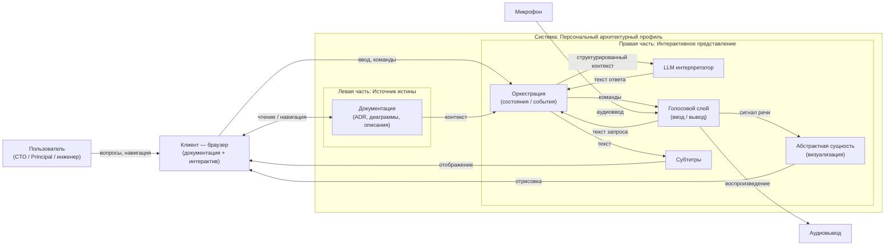

# C4 L1 — Context: Персональный архитектурный профиль (сайт)

> Уровень: C4 / L1 (System Context)  
> Цель: показать границу системы и её взаимодействия с внешними акторами/системами.  
> Нотация: Mermaid (C4-like)

## Примечания к чтению диаграммы

- **Граница системы** включает две концептуальные части:  
  **Источник истины** (лево) и **интерактивное представление** (право).
- **Канонический контент** в интерактивной части — текст (вопрос/ответ); голос и визуализация — производные представления.
- Внешние зависимости показаны намеренно минимально (устройства ввода/вывода). Если появится внешний провайдер LLM/TTS/ASR — он будет добавлен на L2 (Container) как внешний контейнер/сервис.