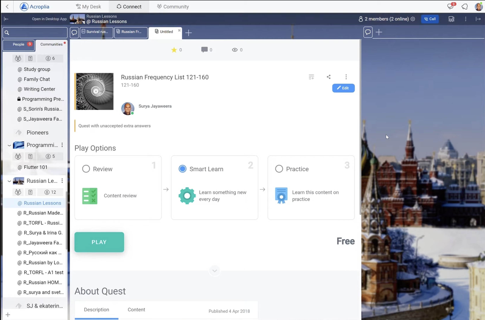

# Acroplia — All-in-one платформа для бизнес-коллаборации

## Контекст системы

Продуктовая компания. B2B SaaS-платформа, объединяющая в одном продукте
весь инструментарий для совместной работы:

- **Видеозвонки** (аналог Google Meet) — на базе Jitsi
- **Чат** — внутренние коммуникации
- **Совместное редактирование документов** (аналог Google Docs) — real-time
- **Интерактивная доска** (аналог Miro) — Canvas
- **Файловое хранилище** (аналог Google Drive)

Амбиция: единая среда для работы бизнеса вместо набора разрозненных инструментов.

## Роль

Руководитель команды бэкенд-разработки (7–13 разработчиков).

Полная ответственность за все архитектурные и технические решения бэкенда,
а также за промежуточный слой взаимодействия между фронтендом и бэкендом.

## Технические вызовы

Платформа такого класса предъявляет нетривиальные требования:

- **Real-time синхронизация** — совместное редактирование документов
  и интерактивная доска требуют консистентного состояния у всех участников
- **WebRTC / Jitsi** — интеграция и управление видеоконференциями
- **Canvas** — интерактивная доска с многопользовательским редактированием
- **Интеграция подсистем** — единый продукт из нескольких концептуально
  разных инструментов с общим контекстом пользователя и данных

## Стек

Backend: Kotlin, PostgreSQL, Hibernate, Redis  
Frontend: React  
Mobile: Flutter

## Главный вызов: стабилизация системы, выросшей из MVP

Архитектура была изначально заложена под MVP с минимальным функционалом.
За несколько лет разработки система значительно выросла,
но архитектурный фундамент не менялся — это привело к нестабильности.

Дополнительный фактор: фронтенд запрашивал большой объём данных
при старте загрузки, что создавало узкие горлышки.

**Что делал:**
- Диагностика и устранение архитектурных узких мест
- Оптимизация передачи данных между фронтендом и бэкендом
- Рефакторинг критичных частей системы без остановки разработки
- Вынос DTO в единый модуль для синхронизации контрактов между backend и client —
  устранил расхождения и упростил взаимодействие между командами

Классическая задача: улучшить летящий самолёт не приземляя его.

## Исследование QUIC

Одним из направлений оптимизации было исследование протокола **QUIC**
(впоследствии ставшего основой HTTP/3) как замены TCP для снижения задержек.

Предложил и обосновал внедрение — это был ранний adoption протокола
до его широкого распространения в индустрии. Впоследствии QUIC внедрялся
и в МРС Платформу.

## Итог

Продукт не был выпущен в production. Стартап завершил работу на стадии
активной разработки по двум причинам:
- Руководство отказалось от переработки frontend-архитектуры, которая
  создавала узкие горлышки при загрузке
- Принято решение о полном переписывании: JVM-монолит → TypeScript-микросервисы,
  что фактически означало начало с нуля

Опыт ценен именно решением нетривиальных технических задач
(real-time синхронизация, WebRTC, Canvas, ранний QUIC) — а не фактом релиза.
